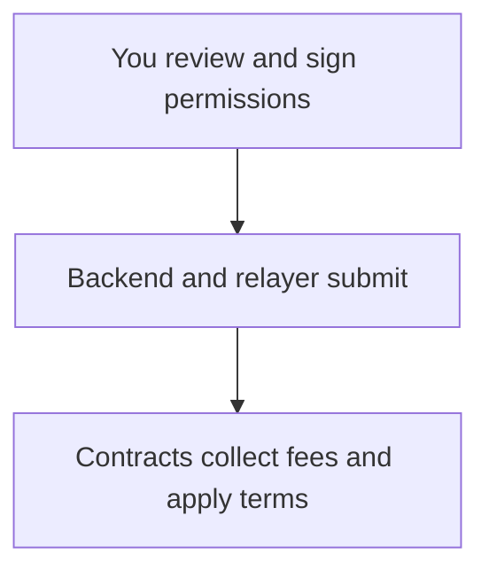

# What you sign

A signature grants permission to act on your funds. Review the action and the fee separately, even when the app presents them together.

## Two ways to approve an action

A **wallet transaction** signs the complete transaction that your wallet submits. The transaction source pays the Stellar network fee in XLM.

A **relayed action** signs contract permissions. The relayer builds and submits the transaction using its own network account. You pay a token fee through the fee forwarder.

The **backend** prepares requests and passes signed permissions to the relayer. It also serves display prices and account history. These services do not replace contract checks.

## Follow a relayed trade

| Part | Responsibility |
| --- | --- |
| Your wallet | Approves the permissions presented to you. |
| Backend and relayer | Prepare, refresh execution inputs, and submit. |
| Fee forwarder | Checks the signed fee terms and collects the fee. |
| Router | Bundles calls and can attempt a fill after order creation. |
| Market and oracle | Enforce order terms, risk limits, and valid prices. |

With **Instant fill**, a relayed market order can be created and filled in the same transaction. An order left resting needs a later keeper fill. Limit and stop orders usually wait for their trigger. See [Orders](../trading/orders.md) for these execution modes.

## Check the permission to trade

For an order, review the market, account, side, size, collateral, order kind, trigger, price bound, and expiry. An increase can transfer collateral and an execution fee into the market. Exit orders can transfer their own execution fees too.

A cancellation, claim, vault order, wallet transfer, or session change grants a different permission. Review every action in a batch.

:::warning A price bound limits price
The bound does not cap trade fees, impact fees, funding, or borrowing interest. Those costs follow the market's rules at execution. An absent price bound accepts any verified price that passes the other checks.
:::

## Check the permission to pay a relay fee

The fee permission names the token, maximum amount, expiry, recipient, and target action. The recipient is signed. The relayer chooses the actual fee within the cap. The maximum is permission to charge that amount, not a guaranteed final quote.

A whole-transaction failure reverses the token fee. A successful transaction can still pay it while a recoverable fill failure leaves the order resting.

:::info Review the token approval
When signing, a token approval grants the fee forwarder an allowance of your maximum amount until its expiry. Check its token and spender alongside the fee terms. [Fee forwarder](/technical/router/fee-abstraction) explains the collection rules.
:::

## Understand what stays flexible

Priced relay flows let the backend refresh the price report after signing. Separate market permissions still bind the order terms and transfers you approve. The market refuses a fill outside those terms.

The app derives a market order's price bound from your slippage limit. Its limit and stop orders, including take profit and stop loss, have no separate price bound.

The authorization expiry limits when those permissions can be used. An order's expiry separately limits when a keeper can fill the order. For repeated permissions, read [One-click trading](./one-click-trading.md). For results and retries, read [Pending and failed transactions](./transactions.md).

:::warning Trust the backend within your signed limits
You trust the backend to choose the actual fee and a suitable price report. The fee cannot exceed your signed maximum, and a fill must satisfy your order terms, any price bound, and the oracle's freshness checks. These limits do not guarantee the best available fee or price.
:::
