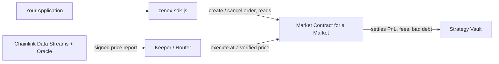

# Integrations Overview

Zenex is designed to be embedded. Every market is a public, permissionless primitive: any frontend, aggregator, wallet, or trading bot can call its functions directly, and any developer can offer Zenex perpetuals without whitelisting, an API gateway, or owning the user relationship. Each market settles every trade against its own strategy vault regardless of which interface initiated it.

## One contract per market

Each market is its own market contract instance, identified by its contract address. The [factory](./sdk#factorycontract) deploys an isolated pair per market: one market contract plus one strategy vault, wired together atomically. A market contract instance _is_ the market: it carries an immutable 32-byte `feed_id` price-stream anchor, its own configuration, its own status, and its own netted positions. To integrate a second market you point the SDK at a second market address.

Positions are netted, one per `(user, is_long)`: a user holds at most one long and one short position per market. Read a position with `getPosition(user, isLong)`. The zeroed position row is the canonical closed state.

## The order then keeper-execute flow

Trading splits into two roles: a price-free create and a price-bearing fill.

**Traders** only create and cancel orders, and the orders carry no price. Creating an order is a plain, price-free write: it validates the order shape, escrows the order's collateral, allocates an id, and stores the order for a keeper to fill later. Take-profit and stop-loss are ordinary decrease orders that carry a trigger, not a separate object attached to a position.

**Keepers** are permissionless. Anyone can fill a resting order by calling `execute_order` and passing a signed Chainlink Data Streams report. The market contract verifies that report against its immutable feed anchor, applies the fill at the verified bid/ask, and pays the caller a keeper reward out of the trade fee. The `keeper` address is just the reward recipient named by the caller. It is not authenticated. The trader already consented by signing the create. Keepers also drive liquidations, auto-deleveraging, vault-order fills, and index accrual.

Every order escrows at creation on the trader's own signature: an increase locks its margin plus the flat execution fee, a decrease locks the execution fee alone, and a vault order locks its assets or shares. A cancel refunds the escrow, so an integrator never needs a standing token allowance to the market.

For a trader, the SDK builds a price-free `create_order` operation that the user signs and submits. A keeper (your own backend, a public keeper, or the [market router](./sdk#marketroutercontract)) then fetches a fresh report and fills it. If you want to open and fill in one atomic transaction, the router's `create_and_fill` does both: it runs the create and fills it fill-or-kill.

## The market router

The [market router](./sdk#marketroutercontract) is a stateless batching contract for keepers and integrators. It runs many calls in one transaction (`multicall` for all-or-nothing, `multicall_try` to isolate each failure), and it composes the create-and-fill flows (`create_and_fill` fill-or-kill, `create_and_try_fill` leaving the order resting on a failed fill). Each of the three has a `_with_fee` variant that collects a relayer fee from the user first, so a sponsored transaction is one call. A keeper uses the router to fill a batch of orders against a single verified price. An integrator uses `create_and_fill` to give users an atomic open.

## Events for indexing

Every state change emits a typed event. The 18 market events carry itemized fill receipts (`open_fill`, `increase_fill`, `decrease_fill`, `close_fill`, `liquidation`) with both lifecycle boundaries chain-attested: `open_fill` marks an empty side opening and `close_fill` a position zeroing, so an indexer keys lifecycles on the event kind alone. The SDK ships the event shapes as typed interfaces you decode against. See [Indexing](./indexing) for the full event catalog.

## What's next

- [Quickstart](./quickstart) walks a minimal end-to-end flow: create an order, fill it, read the position back.
- [SDK](./sdk) is the flat reference for every builder, parser, loader, and quote helper an integrator touches.
- [Price feed](./price-feed) covers serving signed price reports to the keepers that fill orders.
- [Indexing](./indexing) documents the event stream and the indexing path.
- [Agent wallet](./agent-wallet) defines the supported key and account boundary for automated integrators.
