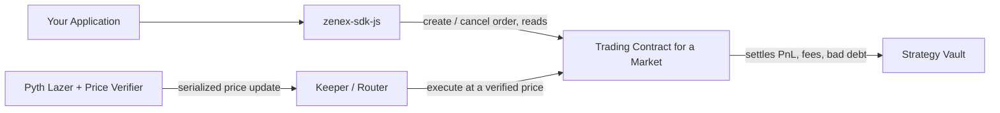

# Integrations Overview

Zenex is designed to be embedded. Every market is a public, permissionless primitive: any frontend, aggregator, wallet, or trading bot can call its functions directly, and any developer can offer Zenex perpetuals without whitelisting, an API gateway, or owning the user relationship. Each market settles every trade against the same shared strategy vault regardless of which interface initiated it.

## One contract per market

Each market is its own trading contract instance, identified by its contract address rather than a numeric id. The [factory](./sdk#factorycontract) deploys an isolated pair per market: one trading contract plus one strategy vault, wired together atomically. A trading contract instance _is_ the market: it carries an immutable `(feed_id, exponent)` oracle anchor, its own configuration, its own status, and its own netted positions. To integrate a second market you point the SDK at a second trading address.

Positions are netted, one per `(user, is_long)`: a user holds at most one long and one short position per market. Read a position with `getPosition(user, isLong)`; the zeroed position row is the canonical closed state.

## The order then keeper-execute flow

Trading splits into two roles that never share a transaction.

**Traders** only create and cancel orders, and the orders carry no price. A trader signs with their own key and consents to collateral movement through a token allowance. Creating an order is a plain, price-free write: it validates the order shape, allocates an id, and stores the order for a keeper to fill later. Take-profit and stop-loss are ordinary decrease orders that carry a trigger, not a separate object attached to a position.

**Keepers** are permissionless. Anyone can fill a resting order by calling `execute_order` and passing a serialized Pyth Lazer price update. The trading contract verifies that price against its immutable feed anchor, applies the fill at the verified bid/ask, and pays the caller a keeper reward out of the trade fee. The `keeper` address is just the reward recipient named by the caller; it is not authenticated. The trader already consented through the allowance set at (or before) order creation. Keepers also drive liquidations, auto-deleveraging, vault-order fills, and index accrual.

Collateral moves at fill through the token allowance, not at order creation. The one exception is vault orders (deposits and redeems), which escrow their assets or shares in the trading contract at creation and settle later.

For a trader, the SDK builds a price-free `create_order` operation that the user signs and submits. A keeper (your own backend, a public keeper, or the [trading router](./sdk#tradingroutercontract)) then fetches a fresh price and fills it. If you want to open and fill in one atomic transaction, the router's `create_and_fill` does both: it sets the allowance, creates the order, and fills it fill-or-kill.

## The trading router

The [trading router](./sdk#tradingroutercontract) is a stateless batching contract for keepers and integrators. It runs many calls in one transaction (`multicall` for all-or-nothing, `multicall_try` to isolate each failure), composes the dependent create-and-fill flows (`create_and_fill`, `create_and_try_fill`, `create_and_try_fill_vault_order`), and sweeps a flagged side back toward its clear target with `adl_sweep`. A keeper uses it to fill a batch of orders against a single verified price; an integrator uses `create_and_fill` to give users an atomic open.

## Events for indexing

Every state change emits a typed event. The 14 trading events split fill receipts (`increase_fill`, `decrease_fill`, `liquidation`) from the resulting position snapshot (`position_update`), so an indexer can record both the itemized economics of a fill and the netted position that resulted. The SDK ships decoders keyed on the on-chain topic layout for Soroban RPC, Mercury, and Goldsky payloads. See [Indexing](./indexing) for the full event catalog.

## What's next

- [Quickstart](./quickstart) walks a minimal end-to-end flow: create an order, fill it, read the position back.
- [SDK](./sdk) is the flat reference for every builder, parser, loader, and decoder an integrator touches.
- [Price feed](./price-feed) covers serving Pyth Lazer price updates to the keepers that fill orders.
- [Indexing](./indexing) documents the event stream and the indexing path.
