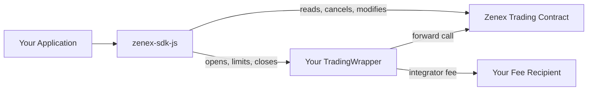

# Integrations Overview

Zenex is designed to be embedded. The core trading contract is a public, permissionless primitive: any frontend, aggregator, wallet, or trading bot can call its functions directly. There is no whitelist, no API gateway, and no application that owns the user relationship. Any developer who wants to offer Zenex perpetuals to their users can do so without permission, and the protocol settles every trade against the same shared vault regardless of which interface initiated it.

To collect a fee on every trade your users make, deploy a `TradingWrapper`. The wrapper is a small, single-purpose Soroban contract you deploy and control: it proxies the three trade-side write functions (`open_market`, `place_limit`, `close_position`), forwards an integrator fee from the user directly to a fee recipient address you set at construction, and otherwise stays out of the way. Everything else goes directly to the trading contract.

## Architecture

Your application uses the SDK to build operations. For an open, limit, or close, the operation calls your wrapper; the wrapper transfers the integrator fee from the user directly to the fee recipient, then forwards the call (with the user as the principal) to the trading contract. For everything else, the operation calls the trading contract directly. From the trading contract's perspective the user is always the principal. The wrapper does not custody collateral, does not hold integrator fees, and does not stand between the user and settlement.

## Integrator Fee

Your wrapper charges a single rate on the position's notional size, capped at `10%`. The fee is transferred from the user straight to your fee recipient on the same transaction as the trade, on top of the collateral transfer. The wrapper holds no balance, so there is no withdraw step. The contract source and fee math live at [`zenex-wrapper`](https://github.com/zenith-protocols/zenex-wrapper).

Protocol fees (base, impact, funding, borrowing, liquidation) are charged separately by the trading contract and split between the strategy vault and the treasury. Integrators do not earn from them. See [Trading Fees](/technical/trading/fee-system) for the breakdown.

## What's Next

To get running fast, see the [Quickstart](./quickstart). For wiring up a Pyth Lazer feed, see [Price feed](./price-feed). For the full SDK reference, see [SDK](./sdk).
