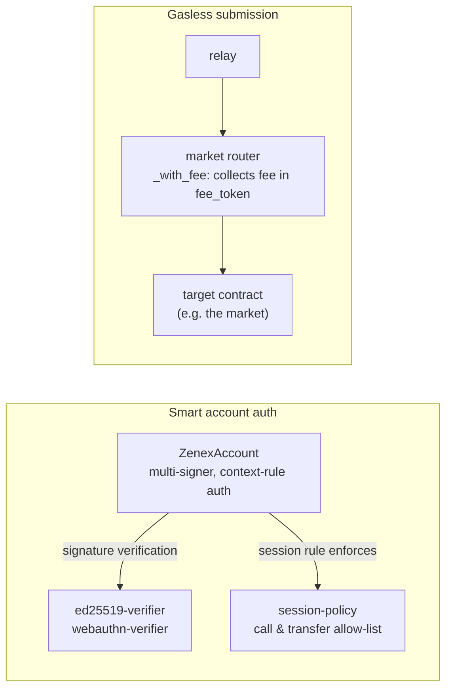

# Smart Account Overview

The Zenex smart account is an **optional** stack of contracts that lets traders use passkeys (WebAuthn), session keys, and gasless transactions. It is not deployed by the perp factory, and users who already have a Stellar wallet can interact with the perp engine directly: the smart account adds UX primitives on top.

The account contract and both signature verifiers are the canonical artifacts published by the [Stellar smart-account kit](https://github.com/stellar/smart-account-kit), built on OpenZeppelin's `stellar-accounts`. The session policy is a Zenex-built contract (the kit publishes no session policy), interface-compatible through the upstream `Policy` trait.

This page is a directory of the pieces and why each exists. It is not a full integration guide.

For an automated integration using a normal Stellar Ed25519 account, see [Agent wallet](../../integrations/agent-wallet). Relay-subsidized account creation is passkey-only.

## The Four Contracts

| Contract | Role |
|---|---|
| **`account`** | The smart account itself. Multi-signer, context-rule based authorization. Upgradeable. |
| **`ed25519-verifier`** | Stateless Ed25519 signature verifier. Deploy once, share across many accounts. |
| **`webauthn-verifier`** | Stateless WebAuthn / passkey signature verifier. Deploy once, share across many accounts. |
| **`session-policy`** | Policy that restricts a session signer to a whitelisted set of target contracts and a single token-transfer destination. |

Gasless submission needs no contract of its own beyond the [market router](../router/overview.md): its `_with_fee` entry points collect the user's fee in-batch (see below).

## How They Fit Together



### `account`

A smart account built on OpenZeppelin's `stellar-accounts`. Authorization is **context-rule based**: each rule binds a set of signers and policies to a specific context type (`Default`, `CallContract`, or `CreateContract`), and the caller specifies which rule to validate per auth context via `AuthPayload.context_rule_ids`. This separates "the owner can do anything" from "a session passkey can do narrow things" within a single account.

The account contract is **upgradeable** so the signer/policy logic can evolve without rotating keys.

### `ed25519-verifier` and `webauthn-verifier`

Both verifiers are **stateless and reusable**. They take a message hash, a public key, and a signature, and return a verdict. Deploy each once per network. Many smart accounts can point at the same verifier address.

`webauthn-verifier` exists because passkeys produce P-256 (secp256r1) signatures wrapped in WebAuthn-specific framing (`authenticatorData`, `clientDataJSON`) that must be parsed before the host's native secp256r1 check can run. The verifier parses the WebAuthn envelope and verifies the P-256 signature.

### `session-policy`

A policy contract that solves the DeFi composability problem where a trading action triggers a sub-auth on the token contract. A trader opens a position by calling `create_order` on the market contract, which escrows the margin and keeper execution fee at creation through a `token.transfer` sub-auth from the trader to the market contract. Without a policy, allowing the session passkey to authorize the token contract would let it drain funds to any address. With this policy attached:

- Calls are restricted to a whitelist of target contracts (for example the market contract and the market router).
- Token transfers are locked to a single allowed destination (the market contract). Token approvals are not destination-checked, so a session key can approve any spender on a whitelisted token.

Typical setup, as the Zenex app uses it:

```text
Rule 0 (Default, "owner")    : passkey (WebAuthn) signer, no policies, full access
Rule 1 (Default, "session")  : ephemeral ed25519 session key + SessionPolicy, restricted, expires
```

The passkey owner bypasses the policy. The session key is locked into the session scope and carries an expiry ledger, so it lapses on its own. This is what makes one-click trading safe: the app registers a short-lived session key (four hours in the current app) that can sign trades without a WebAuthn prompt, and even a fully compromised session key can only move the user's collateral into the market, nowhere else. Managing the rules themselves always takes the passkey — the policy does not allow the account as a call target, so a session key can never extend or replace its own rule.

### Gasless submission

Gasless transactions ride the [market router](../router/overview.md)'s `_with_fee` entry points rather than a dedicated forwarder contract. The user signs the prefix `(calls, fee_token, max_fee_amount, fee_expiration)`, so the batch's content, the fee token, the fee ceiling, and the authorization's lifetime are all pinned by the user's own signature; the replaceable tail `(fee_amount, fee_recipient)` sits outside the signature and is set by the submitting relay, bounded by the signed `max_fee_amount`. The relay pays the transaction's XLM gas and collects its fee in the fee token (USDC in the Zenex app) inside the same atomic batch.

A trader's `create_order` and `create_vault_order` are **price-free** and fully authenticated by the user's own `require_auth` over every argument, so nothing in the signed batch is left for the relay to fill in except the fee tail — and, on the `create_and_fill_with_fee` flow, the verified price report for the immediate fill, which the trader never signs because the oracle verifies it independently.

## Relationship to the Perp Engine

The perp engine treats the smart account address the same as any other caller: an address that produces a valid `require_auth` result on the methods that need it. The smart account stack is what makes the trader-facing experience possible (passkey login, session keys, gasless tx), layered entirely on top of the unmodified perp contracts.

If you are auditing the perp protocol, you can scope the smart account contracts out: nothing in `zenex-contracts` depends on a specific account implementation.
