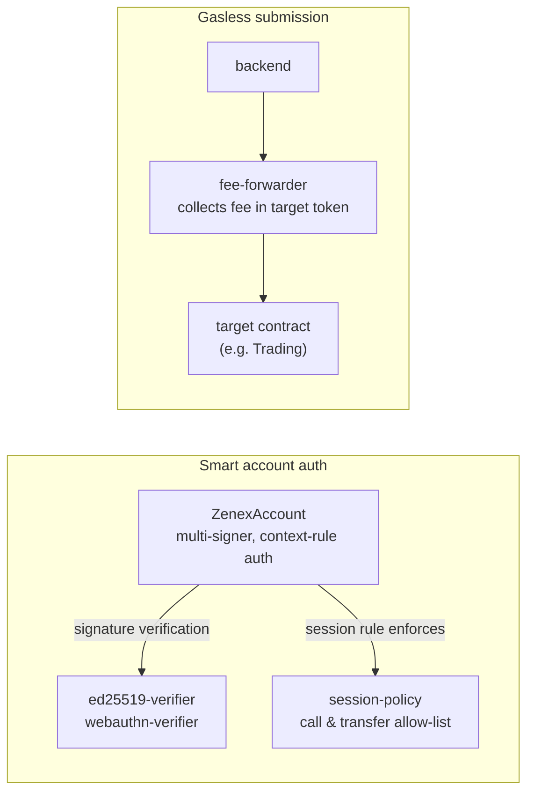

# Smart Account Overview

The Zenex smart account is an **optional** stack of contracts that lets traders use passkeys (WebAuthn), session keys, and gasless transactions. It is developed in a separate repo, [`soroban-smart-account`](https://github.com/zenith-protocols/soroban-smart-account), and is not deployed by the perp factory. Users who already have a Stellar wallet can interact with the perp engine directly; the smart account adds UX primitives on top.

This page is a directory of what lives in that repo and why each piece exists. It is not a full integration guide.

## The Five Contracts

| Contract | Role |
|---|---|
| **`account`** | The smart account itself. Multi-signer, context-rule based authorization. Upgradeable. |
| **`ed25519-verifier`** | Stateless Ed25519 signature verifier. Deploy once, share across many accounts. |
| **`webauthn-verifier`** | Stateless WebAuthn / passkey signature verifier. Deploy once, share across many accounts. |
| **`session-policy`** | Policy that restricts a session signer (typically a passkey) to a whitelisted set of target contracts and a single token-transfer destination. |
| **`fee-forwarder`** | Stateless gasless-transaction primitive. A backend pays gas, the user pays a fee in the target token. |

## How They Fit Together



### `account`

A smart account built on OpenZeppelin's `stellar-accounts`. Authorization is **context-rule based**: each rule binds a set of signers and policies to a specific context type (`Default`, `CallContract`, or `CreateContract`), and the caller specifies which rule to validate per auth context via `AuthPayload.context_rule_ids`. This separates "the owner can do anything" from "a session passkey can do narrow things" within a single account.

The account contract is **upgradeable** so the signer/policy logic can evolve without rotating keys.

### `ed25519-verifier` and `webauthn-verifier`

Both verifiers are **stateless and reusable**. They take a message hash, a public key, and a signature, and return a verdict. Deploy each once per network; many smart accounts can point at the same verifier address.

`webauthn-verifier` exists because passkeys produce P-256 (secp256r1) signatures with WebAuthn-specific framing (`authenticatorData`, `clientDataJSON`), which the host environment does not validate natively. The verifier parses the WebAuthn envelope and checks the P-256 signature.

### `session-policy`

A policy contract that solves the DeFi composability problem where a trading action triggers a sub-auth on the token contract. A trader opens a position by calling `create_order` on the trading contract and setting a collateral allowance the keeper later draws (`token.approve`). Without a policy, allowing the session passkey to authorize the token contract would let it drain funds to any address. With this policy attached:

- Calls are restricted to a whitelist of target contracts (for example the trading contract and the trading router).
- Token approvals and transfers are locked to a single allowed destination (the trading contract).

Typical setup:

```text
Rule 0 (Default, "owner")    : owner keypair, no policies, full access
Rule 1 (Default, "session")  : passkey + SessionPolicy, restricted
```

The owner bypasses the policy. The passkey is locked into the session scope. This is what makes "log in with a passkey and trade for a week without re-authenticating" safe.

### `fee-forwarder`

A **stateless gasless-transaction primitive**. A backend submits the transaction and pays gas. The user pays a fee in the target token (e.g. USDC). The forwarder pins the user's intent via `require_auth_for_args` and then calls into the target contract.

Two entry points:

| Function | What the user pins | When to use |
|---|---|---|
| `forward` | All fields including `target_args` | **Default.** Safe with any target. The backend cannot substitute args. |
| `forward_unsafe` | Every field **except** `target_args` | Only when the target itself authenticates every argument it cares about, so leaving `target_args` unpinned is safe. |

For v2 trading the safe `forward` path is what a gasless order uses. A trader's `create_order` and `create_vault_order` are **price-free** and fully authenticated by the user's own `require_auth` over every argument, so there is no price blob to exclude and no reason to leave any field unpinned. The keeper attaches the Pyth price later, on its own separate transaction, so gasless submission of the trader's intent never needs to defer an argument to the backend.

## Relationship to the Perp Engine

The perp engine has no knowledge of the smart account stack. It treats the smart account address the same as any other Stellar account: a caller that produces a valid `require_auth` result on the methods that need it. The smart account stack is what makes the trader-facing experience possible (passkey login, session keys, gasless tx) without modifying any of the perp contracts.

If you are auditing the perp protocol, you can scope the smart account contracts out: nothing in `zenex-contracts` depends on a specific account implementation.
