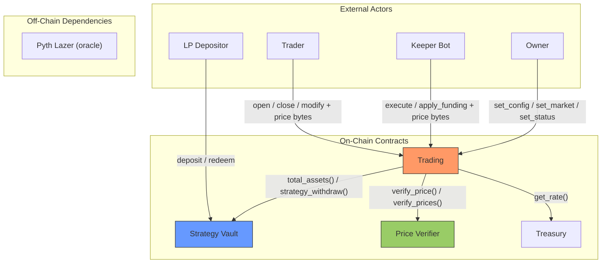

# Architecture Overview

Zenex is a leveraged perpetual futures protocol built on [Stellar Soroban](https://soroban.stellar.org/). The system consists of several smart contracts deployed atomically through a factory, interacting through well-defined interfaces.

## System Contracts

| Contract | Role |
|---|---|
| **Trading** | Core perpetual futures engine handling positions, PnL, fees, funding, liquidation, and ADL |
| **Strategy Vault** | ERC-4626 tokenized vault acting as the liquidity pool and counterparty to traders |
| **Treasury** | Protocol fee accumulator with a configurable rate |
| **Factory** | Deterministic deployer for trading + vault pairs |
| **Governance** | Optional timelock proxy for governance-controlled parameter changes |
| **Price Verifier** | Pyth Lazer oracle that parses and verifies signed price updates |
| **Account** | Smart account with multi-signer support (Ed25519, WebAuthn). Separate repo (`soroban-smart-account`), not part of the perp engine |

## Data Flow

The vault has no knowledge of trading internals. The trading contract calls the vault through a minimal interface (`total_assets`, `strategy_withdraw`). This one-directional dependency simplifies reentrancy analysis.

Trading invokes `verify_price` (singular) on per-trade entrypoints (`open_market`, `close_position`, `modify_collateral`, `execute`) and `verify_prices` (plural) only from `update_status`, where every market price is read at once for the global PnL/ADL pass.

The governance contract is an independent, optional contract. It is not deployed by the factory. When used, it acts as the owner of a trading contract, adding timelock delays to parameter changes.

## Token Flow

All collateral flows through a single SEP-41 token (e.g., USDC). The trading contract acts as custodian for active position collateral. Protocol fees (base, impact, funding, borrowing, liquidation) are not paid on top of collateral; they are debited from the position's collateral inside the trading contract and split between the vault and the treasury.

| Flow | Direction | When |
|---|---|---|
| User to Trading | Collateral on position open | `open_market`, `place_limit` |
| Trading to Vault | LP share of fees (debited from collateral) | Open, close, fill, liquidation |
| Trading to Treasury | Protocol share of fees (debited from collateral) | Open, close, fill, liquidation |
| Vault to Trading | Trader profit payout | `strategy_withdraw` on profitable close |
| Trading to User | Remaining collateral + profit (or zero if liquidated) | `close_position`, keeper TP/SL |
| Trading to Keeper | Caller incentive fee | Keeper `execute` batch |

## Deployment Model

The factory deploys trading and vault as an atomic pair with deterministic, precomputed addresses. Both contracts are fully configured at construction; neither requires a post-deployment initialization step. Implementation detail (salt derivation, deploy ordering, address precomputation) lives on the [Factory](./factory/overview) page.

