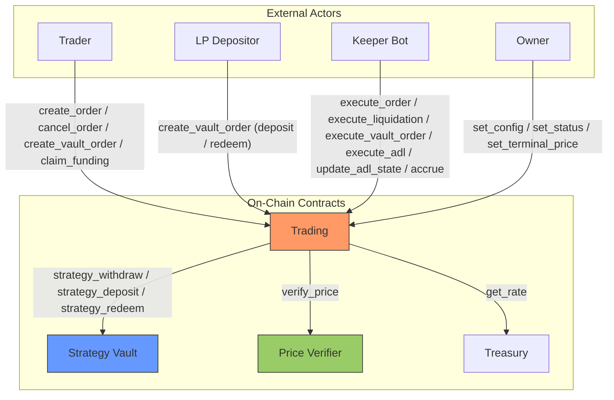

# Architecture Overview

Zenex is a leveraged perpetual futures protocol built on [Stellar Soroban](https://soroban.stellar.org/). Each market is an isolated pair of contracts, a trading engine and a strategy vault, deployed atomically through a factory. The contracts interact through well-defined, one-directional interfaces.

## System Contracts

| Contract | Role |
|---|---|
| **Trading** | Single-market perpetual futures engine handling orders, netted positions, PnL, fees, funding, borrowing, liquidation, and ADL |
| **Strategy Vault** | Tokenized vault acting as the liquidity pool and counterparty to traders, with all mutations gated to the registered strategy (the trading contract) |
| **Treasury** | Protocol fee accumulator with a configurable rate |
| **Factory** | Deterministic deployer for trading + vault pairs |
| **Governance** | Optional timelock proxy for governance-controlled parameter changes |
| **Price Verifier** | Pyth Lazer oracle adapter that verifies signed price updates against a market's feed |

Each trading contract serves exactly one market, identified by its immutable `(feed_id, exponent)` oracle anchors set in the constructor: a deployment is the market. To run BTC and ETH perps you deploy two independent trading + vault pairs through the factory. The trading contract is immutable. Shipping a logic change means deploying a fresh contract and vault pair through the factory.

Users interact with the perp engine through any Stellar wallet. The optional [`soroban-smart-account`](https://github.com/zenith-protocols/soroban-smart-account) repo provides a smart account, signature verifiers, a session policy, and a stateless fee-forwarder for gasless relays. See [Smart Account](./account/overview) for the full breakdown.

## Roles

Four roles interact with a trading contract.

| Role | Authorization | What it does |
|---|---|---|
| **Admin** (owner) | `#[only_owner]` | `set_config`, `set_status`, `set_terminal_price`, and the Ownable transfer surface |
| **Trader** | The user's own signature | Creates and cancels price-free orders and vault orders, claims funding |
| **Keeper** | Permissionless | Fills orders, liquidations, vault orders, and ADL at a verified price for a reward |
| **Maintenance** | Permissionless | Advances accrual indices (`accrue`, `accrue_funding`) and refreshes the per-side ADL flags (`update_adl_state`) |

A trader only ever creates and cancels intents. A permissionless keeper is what actually fills an order against a verified Pyth Lazer price. The keeper is not authenticated: it is simply the reward recipient the caller names, and the trader consented to the fill through the collateral and execution fee escrowed at order creation.

## Data Flow

The trading contract is the only contract directly admin-controlled in the diagram. The price verifier and treasury both have their own owners that can update configuration (`update_max_staleness`, `update_max_confidence_bps`, `update_lazer` on the price verifier, `set_rate` and `withdraw` on the treasury). Those owners may be the same account, separate accounts, or a governance contract per deployment. See the dedicated [Governance](./governance/overview), [Treasury](./treasury/overview), and [Price Verifier](./price-verifier/overview) pages for the full owner-only surface on each contract.

LP deposits and redeems flow through the trading contract as vault orders, not by calling the vault directly. The vault's only mutations are the strategy-gated `strategy_deposit`, `strategy_redeem`, and `strategy_withdraw`, authorized to the registered strategy (the trading contract), so the trading engine is the single writer of vault share supply. The trading contract calls the vault through a minimal interface (`strategy_deposit`, `strategy_redeem`, `preview_redeem`, `strategy_withdraw`, `total_assets`, and the share token's `balance` and `transfer` for redeem escrow). The dependency is one-directional, which keeps the call graph and storage ownership easy to reason about.

Every price-bearing call verifies its price through the same `verify_price` cross-contract call, which validates the submitted Pyth Lazer bytes against the market's immutable `(feed_id, exponent)` anchors. The exception is a delisted market with a stored terminal price, which prices flat and skips verification. Price-free maintenance (`accrue_funding`) and trader intents (`create_order`) carry no price at all.

The governance contract is an independent, optional contract. It is not deployed by the factory and is not bound to any specific target. It can be set as the owner of any admin-controlled contract (trading, treasury, price verifier, or even a separate governance instance) and adds a configurable timelock delay to parameter changes on whatever it owns. Owner-only calls flow through `queue` then `execute`, where `execute` is itself permissionless once the delay has elapsed. The one bypass is `set_status`, which lets the governance owner immediately set the status of a target trading contract without going through the queue, so a market can be frozen in an emergency without waiting for the delay.

## Token Flow

All collateral flows through a single SEP-41 token (e.g., USDC). The trading contract acts as custodian for active position margin and for escrowed vault-order assets and shares. Every order and vault order also escrows a flat execution fee (`exec_fee`, a `Config` field) at creation, paid to the keeper at fill and refunded on cancel. Protocol fees (trade, impact, borrowing, liquidation) are debited from the position's margin inside the trading contract, rather than charged on top of posted collateral, and split between the vault, the treasury, and the keeper. Funding is likewise debited from margin but flows into an internal funding pool credited to the opposing side, paid out through `claim_funding`.

| Flow | Direction | When |
|---|---|---|
| Trader to Trading | Escrowed collateral plus exec fee (increase) or exec fee only (decrease) | `create_order` |
| Trader to Trading | Escrowed deposit assets or redeem shares, plus exec fee | `create_vault_order` |
| Trading to Vault | LP share of fees, trader losses, forfeits, and deposit-fill principal (`strategy_deposit`) | Fills, liquidations, deposit fills |
| Trading to Treasury | Protocol share of trade, borrowing, and vault fill fees and forfeits | Fills, liquidations, vault-order fills |
| Trading to Keeper | Keeper reward: a cut of the trade or vault fill fee, plus the order's escrowed exec fee on order and vault-order fills (liquidation and ADL pay the fee cut only) | Order, liquidation, ADL, and vault-order fills |
| Vault to Trading | Trader profit payout, bad-debt coverage (`strategy_withdraw`), and redeem-fill assets (`strategy_redeem`) | Profitable or underwater closes, redeem fills |
| Trading to Trader | Withdrawal, realized profit, funding claim, redeem payout, liquidation remainder, or escrow refund | Decrease fills, redeem fills, `claim_funding`, soft-tier liquidations, `cancel_order`, `cancel_vault_order` |
| Treasury to Recipient | Protocol revenue withdrawal (destination chosen by owner) | `withdraw` (owner-only) |

Every order escrows at creation: an increase order transfers `collateral + exec_fee` from the trader to the trading contract when `create_order` runs, a decrease order transfers `exec_fee`, and a vault order transfers its deposit assets (or redeem shares) plus `exec_fee`. Cancelling refunds the escrow. Fees are deducted from the escrowed collateral at fill and the resulting margin must still meet the initial-margin requirement, so a fee change between creation and fill at worst makes the fill revert instead of leaving the position under-margined.

## Deployment Model

The factory deploys a trading contract and its strategy vault as an atomic pair with deterministic, precomputed addresses. Each contract's wiring (dependency addresses, ownership, the immutable feed anchors, the full trading config, vault share metadata) is set in its constructor, so neither needs a separate `initialize` call. Because one contract is one market, deployment itself is the market's registration: its parameters are the `Config` passed to `deploy`, and the feed is the `(feed_id, exponent)` pair.

The initial `Config` is a constructor argument, so it takes effect at deployment regardless of who the owner is. Subsequent parameter changes go through the owner, and through the timelock when the owner is a governance contract.

Implementation detail (salt derivation, deploy ordering, address precomputation) lives on the [Factory](./factory/overview) page.
