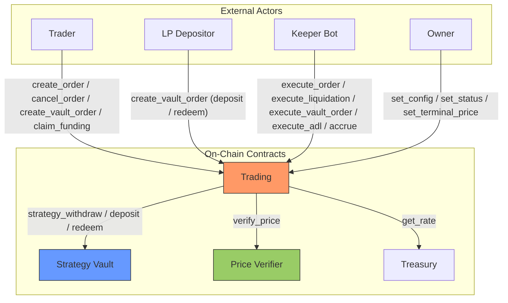

# Architecture Overview

Zenex is a leveraged perpetual futures protocol built on [Stellar Soroban](https://soroban.stellar.org/). Each market is an isolated pair of contracts, a trading engine and a strategy vault, deployed atomically through a factory. The contracts interact through well-defined, one-directional interfaces.

## System Contracts

| Contract | Role |
|---|---|
| **Trading** | Single-market perpetual futures engine handling orders, netted positions, PnL, fees, funding, borrowing, liquidation, and ADL |
| **Strategy Vault** | ERC-4626 style tokenized vault acting as the liquidity pool and counterparty to traders |
| **Treasury** | Protocol fee accumulator with a configurable rate |
| **Factory** | Deterministic deployer for trading + vault pairs |
| **Governance** | Optional timelock proxy for governance-controlled parameter changes |
| **Price Verifier** | Pyth Lazer oracle adapter that verifies signed price updates against a market's feed |

Each trading contract serves exactly one market. There is no market identifier anywhere in the interface: a deployment is the market. To run BTC and ETH perps you deploy two independent trading + vault pairs through the factory. The trading contract is immutable, with no upgrade entry point. Shipping a logic change means deploying a fresh contract and vault pair through the factory, not upgrading an existing one.

Users interact with the perp engine through any Stellar wallet. The optional [`soroban-smart-account`](https://github.com/zenith-protocols/soroban-smart-account) repo provides a smart account, signature verifiers, a session policy, and a stateless fee-forwarder for gasless relays. See [Smart Account](./account/overview) for the full breakdown.

## Roles

Four roles interact with a trading contract.

| Role | Authorization | What it does |
|---|---|---|
| **Admin** (owner) | `#[only_owner]` | `set_config`, `set_status`, `set_terminal_price`, and the Ownable transfer surface |
| **Trader** | The user's own signature | Creates and cancels price-free orders and vault orders, claims funding |
| **Keeper** | Permissionless | Fills orders, liquidations, vault orders, and ADL at a verified price for a reward |
| **Maintenance** | Permissionless | Advances accrual indices (`accrue`, `accrue_funding`) |

A trader only ever creates and cancels intents. A permissionless keeper is what actually fills an order against a verified Pyth Lazer price. The keeper is not authenticated: it is simply the reward recipient the caller names, and the trader consented to the fill through the collateral allowance set at order creation.

## Data Flow

The trading contract is the only contract directly admin-controlled in the diagram. The price verifier and treasury both have their own owners that can update configuration (`update_max_staleness`, `update_max_confidence_bps`, `update_lazer` on the price verifier, `set_rate` and `withdraw` on the treasury). Those owners may be the same account, separate accounts, or a governance contract per deployment. See the dedicated [Governance](./governance/overview), [Treasury](./treasury/overview), and [Price Verifier](./price-verifier/overview) pages for the full owner-only surface on each contract.

LP deposits and redeems flow through the trading contract as vault orders, not by calling the vault directly. The vault gates its own ERC-4626 mutations to the registered strategy (the trading contract), so the trading engine is the single writer of vault share accounting. The trading contract calls the vault through a minimal interface (`deposit`, `redeem`, `strategy_withdraw`, `total_assets`). The dependency is one-directional, which keeps the call graph and storage ownership easy to reason about.

Every price-bearing call verifies its price through the same `verify_price` cross-contract call, which validates the submitted Pyth Lazer bytes against the market's immutable `(feed_id, exponent)` anchors. Price-free maintenance (`accrue_funding`) and trader intents (`create_order`) carry no price at all.

The governance contract is an independent, optional contract. It is not deployed by the factory and is not bound to any specific target. It can be set as the owner of any admin-controlled contract (trading, treasury, price verifier, or even a separate governance instance) and adds a configurable timelock delay to parameter changes on whatever it owns. Owner-only calls flow through `queue` then `execute`, where `execute` is itself permissionless once the delay has elapsed. The one bypass is `set_status`, which lets the governance owner immediately set the status of a target trading contract without going through the queue, so a market can be frozen in an emergency without waiting for the delay.

## Token Flow

All collateral flows through a single SEP-41 token (e.g., USDC). The trading contract acts as custodian for active position margin and for escrowed vault-order assets and shares. Protocol fees (trade, impact, funding, borrowing, liquidation) are not paid on top of collateral. They are debited from the position's margin inside the trading contract and split between the vault, the treasury, and the keeper.

| Flow | Direction | When |
|---|---|---|
| Trader to Trading | Collateral drawn from the trader's allowance | `execute_order` fill of an Increase |
| Trader to Trading | Escrowed deposit assets or redeem shares | `create_vault_order` |
| Trading to Vault | LP share of fees, trader losses, forfeits, bad-debt backing | Fills, liquidations |
| Trading to Treasury | Protocol share of trade and borrowing fees and forfeits | Fills, liquidations |
| Trading to Keeper | Keeper reward (a cut of the trade or vault fill fee) | Any keeper entry point |
| Vault to Trading | Trader profit payout | `strategy_withdraw` on a profitable close |
| Trading to Trader | Withdrawal, realized profit, funding claim, or refund | Decrease fills, `claim_funding`, `cancel_order` |
| Treasury to Recipient | Protocol revenue withdrawal (destination chosen by owner) | `withdraw` (owner-only) |

Collateral moves at fill, not at order creation, drawn from the trader's token allowance. The one exception is vault orders, which escrow their assets or shares in the trading contract at creation and settle at fill. Because fees are subtracted from the posted collateral at fill, a later fee or rate change can never break an existing order allowance: order validation ensures the posted collateral covers the fees.

## Deployment Model

The factory deploys a trading contract and its strategy vault as an atomic pair with deterministic, precomputed addresses. Each contract's wiring (dependency addresses, ownership, the immutable feed anchors, the full trading config, vault share metadata) is set in its constructor, so neither needs a separate `initialize` call. Because one contract is one market, there is no per-market registration step after deployment: the market's parameters are the `Config` passed to `deploy`, and the feed is the `(feed_id, exponent)` pair.

If a deployment will route ownership through a governance contract, deploy under a regular account owner and transfer ownership to governance afterward, so the initial config is not forced through the timelock during bringup.

Implementation detail (salt derivation, deploy ordering, address precomputation) lives on the [Factory](./factory/overview) page.
