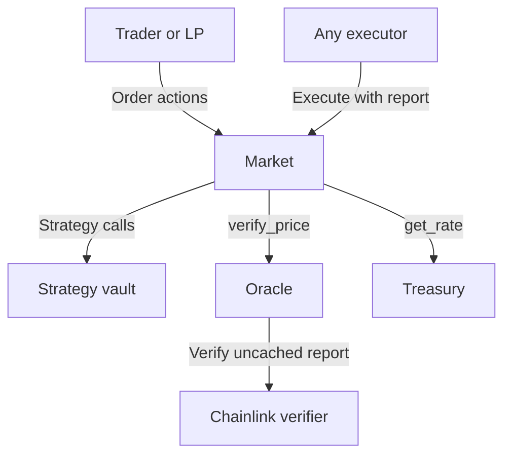
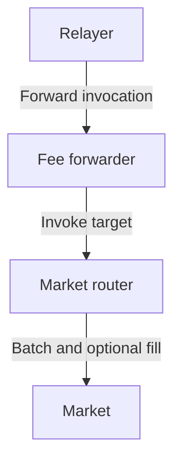

# Architecture overview

Zenex runs perpetual futures markets on Stellar Soroban. Each market is a pair: a market contract owns trade state and margin, and a strategy vault holds its backing liquidity. Different pairs keep separate positions, configuration, and liquidity. They can share dependencies such as an oracle, treasury, or settlement token.

## Contract responsibilities

| Contract | Responsibility and custody |
| --- | --- |
| [Market](./market/overview.md) | Stores orders, netted positions, risk configuration, and credits. Holds position margin, pending-order escrow, and tokens reserved for credit claims. |
| [Strategy vault](./vault/overview.md) | Holds the market's backing liquidity and issues transferable shares. Its registered market authorizes strategy deposits, redemptions, and payout draws. |
| [Oracle](./oracle/overview.md) | Checks signed reports against the requested feed and its price-validity rules. Uses Chainlink's verifier and caches accepted report bodies. |
| [Treasury](./treasury/overview.md) | Stores the protocol fee-share rate and receives collected fees. Its owner changes the rate and withdraws fees. |
| [Factory](./factory/overview.md) | Deploys market/vault pairs. Its owner selects the code hashes and treasury used for future deployments. |
| [Governance](./governance/overview.md) | Can own another contract and delay its queued administrative calls. Stores the queue; `set_status` has an immediate path. |
| [Market router](./router/batching.md) | Batches calls and can create and fill an order in one transaction. Has no persistent state, funds, owner, or special market authority. |
| [Fee forwarder](./router/fee-abstraction.md) | Collects a token fee, then invokes a target. Temporarily pulls the signed cap, pays the actual fee, and refunds the remainder before calling the target. |

## Contract boundaries

The diagram shows runtime contract calls. The market is the entry point for trading and vault-order actions; its dependency calls have the boundaries described below.

The vault requires authorization from its registered market for `strategy_deposit`, `strategy_redeem`, and `strategy_withdraw`. Holding vault shares does not grant that authority. Liquidity providers deposit or redeem through the market's [vault orders](./market/vault-orders.md); ordinary share transfers use the token's own authorization rules.

For price-bearing execution, the market requests a checked price from the oracle. The oracle sends uncached reports to its constructor-bound Chainlink verifier and applies feed, freshness, and sanity checks. A stored terminal price replaces report verification on the retirement path. The market also reads the treasury's fee-share rate; paying that share is a settlement-token transfer to the treasury address. See [dependency interfaces](./market/dependencies.md) and [price verification](./oracle/verify-price.md).

## Who authorizes each action

| Actor | Authority |
| --- | --- |
| Trader or liquidity provider | Authorizes their order creation, cancellation, or credit claim, including the required escrow transfers. Order terms constrain later execution. |
| Executor | Anyone can call order execution, liquidation, or ADL when their gates pass. No keeper signature is required. The `keeper` argument identifies the reward recipient; the trader or router can also execute an order. |
| Contract owner | Authorizes configuration, status, ownership, and upgrade calls where the contract exposes them. Governance can hold this authority. |
| Relayer | Submits authorized user actions and chooses permitted unsigned inputs. The forwarder limits its actual fee to the signed cap; the market enforces order terms, any price bound, and price-validity checks. |

Permissionless execution does not grant permission to edit an order or bypass its gates. Conversely, a valid report need not be the newest acceptable report. The [fee-forwarder reference](./router/fee-abstraction.md) explains which arguments are signed, including the difference between fixed and dynamic forwarding.

## A trade through the contracts

1. **Create and escrow.** The user authorizes `create_order`. The market stores the order and pulls its execution fee, plus collateral for an increase, into market escrow. Vault orders similarly escrow deposit assets or redeem shares and their execution fee.
2. **Verify and execute.** An executor supplies a report. The market checks the price, order conditions, and risk gates, then updates the account's netted position. Creation and filling can share one transaction through the router; resting orders remain available for later execution.
3. **Settle.** The market calculates the trader, vault, keeper, and treasury legs. It sends a positive vault leg to the vault or draws a negative leg from it, then pays the other recipients. Fees and realized profit or loss change the position or payout without a new wallet authorization at fill.

Funding payments stay in the market's credit pool for claims. A failed trader-payout transfer can become claimable credit; this fallback does not cover every settlement transfer. The [order reference](./market/orders.md), [position lifecycle](./market/position-lifecycle.md), and [settlement reference](./market/fee-system.md) give the exact gates and accounting.

A relayed trade can add these wrappers around the same market actions:

The forwarder authenticates the fee payer. The router adds no authorization of its own; each target authenticates the user actions it requires. The market's execution fee rewards the executor, while the relay fee pays for transaction submission. A strict fill failure reverts creation and the relay fee. A recoverable fill failure through `create_and_try_fill` can leave the order resting and the relay fee collected. [Transactions and authorization](./router/overview.md) covers these outcomes and smart-account session permissions.

## Deployment and administration

The factory deploys each pair atomically at addresses derived from `admin` and a salt. The vault registers the market as its strategy, and the market stores its vault, token, oracle, treasury, feed, and initial configuration. Deployment requires `admin` authorization; that address becomes the market owner. The factory owner separately controls the code hashes and treasury selected for future pairs. See [deployment](./factory/deploy.md).

The market owner can change configuration and upgrade market code while retaining its address and authority over the vault. The vault has no upgrade entry, but its registered market's behavior can change. When governance owns a target, queued administrative calls wait for the timelock and anyone can execute them after the delay. Governance's owner can forward `set_status` immediately; the target still enforces its allowed transitions. See [ownership and upgrades](./market/dependencies.md#ownership-and-upgrade) and [governance](./governance/timelock.md).

## Find a reference

Use [Units and scales](./units.md) before interpreting contract amounts. The contract links above lead to their complete references. [Deployments](/deployments) identifies current addresses, owners, code hashes, and parameters. The [utility contracts](https://github.com/zenith-protocols/zenex-util-contracts) are published on GitHub.
