# Architecture overview

This page covers the contracts that make up a Zenex deployment and who calls them. It also covers how a call and a token move between the contracts, and how a new market comes into existence. The pages under each contract hold the entry points, storage, events, and errors in full. The [units page](./units.md) defines token-dec, feed precision, and the other scales used below.

Zenex is a leveraged perpetual futures protocol on [Stellar Soroban](https://soroban.stellar.org/). Each market is an isolated pair of contracts, the `market` and its strategy vault, deployed together through the factory. The `market` takes orders, holds positions and their margin, and settles every fill. The vault holds the liquidity that stands on the other side of every position in that market. The contracts call each other through small, one-directional interfaces. The call graph is therefore explicit, and each piece of state has one writer.

## Every user call enters through the market

```mermaid
flowchart TB
    subgraph Actors["External actors"]
        direction LR
        Trader["Trader"]
        LP["Liquidity provider"]
        Keeper["Keeper"]
        Owner["Owner"]
    end

    subgraph Contracts["On-chain contracts (Zenex in green, Chainlink in blue)"]
        Market["Market"]
        Vault["Strategy vault"]
        Oracle["Oracle"]
        Treasury["Treasury"]
        Verifier["Chainlink Data Streams verifier"]
    end

    Trader -->|"create_order / cancel_order / claim_credit"| Market
    LP -->|"create_vault_order / cancel_vault_order"| Market
    Keeper -->|"execute_order / execute_liquidation / execute_vault_order / execute_adl"| Market
    Keeper -->|"accrue / update_adl_state (unrewarded)"| Market
    Owner -->|"set_config / set_status / set_terminal_price"| Market

    Market -->|"verify_price"| Oracle
    Oracle -->|"verify"| Verifier
    Market -->|"strategy_deposit / strategy_redeem / strategy_withdraw"| Vault
    Market -->|"get_rate"| Treasury

    style Market fill:#0f2e24,stroke:#29a383,stroke-width:2px
    style Vault fill:#0f2e24,stroke:#29a383
    style Oracle fill:#0f2e24,stroke:#29a383
    style Treasury fill:#0f2e24,stroke:#29a383
    style Verifier fill:#0d2847,stroke:#3b82f6
```

Every trader, liquidity provider, and keeper call lands on the `market`. On the trade path the `market` alone calls the vault, the oracle, and the treasury. It is the only caller that can deposit, redeem, or withdraw vault assets, and the only caller that mints or burns shares. It sends each keeper-supplied report to the oracle for checking. It asks the treasury for the rate that sets the protocol's share of each fee. Once the owner stores a terminal price on a delisted market, the `market` prices flat at that price and verifies no report. The oracle hands the signature check to Chainlink's verifier, whose address the oracle constructor sets and no entry point changes.

The diagram omits the router, the factory, and governance. The router batches calls to the `market` and holds no privilege. The factory deploys market and vault pairs, and its owner calls `set_init_meta`. The treasury owner calls `set_rate` and `withdraw`. Governance stands in for an owner and delays the owner calls that pass through it, except `Governance::set_status`.

## Seven contracts make up a deployment

| Contract | Symbol | Role |
|---|---|---|
| **[Market](./market/overview.md)** | `MarketContract` | Orders, netted positions, profit and loss (PnL), fees, funding, borrowing, liquidation, and auto-deleveraging (ADL) for one perpetual futures market. Also the entry point for vault deposits and redemptions |
| **[Strategy vault](./vault/overview.md)** | `StrategyVaultContract` | Tokenized liquidity pool and counterparty to every position in its market. Its registered strategy, the `market`, is the only caller that can deposit, redeem, or withdraw assets. Shares are a standard fungible token |
| **[Oracle](./oracle/overview.md)** | `Oracle` | Decodes a signed Chainlink Data Streams V3 report, checks it against the caller's feed, and applies the freshness and sanity gates |
| **[Treasury](./treasury/overview.md)** | `TreasuryContract` | Holds the protocol fee rate, bounded to 0 through 50 percent, and the collected fees. Its owner changes the rate and withdraws fees |
| **[Factory](./factory/overview.md)** | `FactoryContract` | Deploys market and vault pairs at deterministic addresses |
| **[Governance](./governance/overview.md)** | `GovernanceContract` | Optional timelock. Its owner queues admin calls on the contracts it owns, and anyone executes them after the delay. `set_status` bypasses the delay |
| **[Market router](./router/overview.md)** | `RouterContract` | Stateless batcher with no privilege. It runs several trader calls and an optional keeper fill in one transaction. The `_with_fee` entries also collect a relayer fee |

One `market` serves one perpetual market, identified by the immutable `feed_id` set in its constructor. A BTC market and an ETH market are two independent pairs. Each pair has its own vault, its own `Config`, and its own risk.

## Four roles call the market

| Role | Authorization | What it does |
|---|---|---|
| **Owner** | The owner's signature | Calls `set_config`, `set_status`, `set_terminal_price`, `upgrade`, and the ownership entries `transfer_ownership`, `accept_ownership`, and `renounce_ownership`. Behind a governance contract, these calls queue and wait for the delay. `Governance::set_status` reaches the `market` at once |
| **Trader** | The trader's own signature | Creates and cancels orders with `create_order` and `cancel_order`. Collects earned funding and parked payouts with `claim_credit`. A trader call carries no price report |
| **Liquidity provider** | The liquidity provider's own signature | Creates and cancels vault orders with `create_vault_order` and `cancel_vault_order`. A vault order deposits assets or redeems shares |
| **Keeper** | None, any account may call | Calls `execute_order`, `execute_vault_order`, `execute_liquidation`, and `execute_adl` at a verified price for a reward. Also calls `accrue` and `update_adl_state`, which carry a price and pay no reward |

A trader creates and cancels orders. A keeper fills an order at a price it proves against the market's oracle feed. The `keeper` argument names the reward recipient and authorizes nothing. The trader consents to a fill through the escrow funded at creation and through the `trigger_price` and `price_bound` signed into the order. Anyone can run a keeper, including the trader. The [router](./router/overview.md) lets a trader create and fill an order in one transaction.

## Every settlement leg moves through the market

All collateral in a market is one token that implements the Stellar Ecosystem Proposal 41 (SEP-41) interface, the settlement token. The `market` is custodian of position margin and of the assets, shares, and fees escrowed behind pending orders. Every order and vault order escrows a flat execution fee at creation. The fee is `exec_fee`, a `Config` field (token-dec). It pays the keeper at fill and refunds on cancel.

The `market` debits each protocol fee from the position's margin at fill, so the fill takes no token from the trader's account beyond the escrow funded at creation. The fee types are trade, impact, borrowing, and liquidation. The [Position lifecycle](./market/position-lifecycle.md) page gives the increase and decrease paths and the checks that follow the debit. The [Fees and settlement](./market/fee-system.md) page gives the fee legs.

Funding is also debited from margin, but it stays inside the `market`. When a position settles, a paying position adds its funding to `credit_pool`, a ledger of tokens the `market` holds for claims. A receiving position adds its earned funding to its claimable credit and to `credit_owed`. The trader collects the credit with `claim_credit`. A payout whose token transfer fails parks as the same kind of credit. A dropped trustline for the settlement token is one cause. A failed transfer therefore never stalls a fill. The [funding rate page](./market/funding-rate.md) describes the pool.

| Flow | What moves | Entry |
|---|---|---|
| Trader to market | Margin plus `exec_fee` for an increase, `exec_fee` alone for a decrease | `create_order` |
| Liquidity provider to market | Deposit assets or redeem shares, plus `exec_fee` | `create_vault_order` |
| Market to vault | The positive vault leg, which is the fees left after the keeper and treasury cuts plus realized trader losses. Also deposit principal through `strategy_deposit` | Fills, liquidations, deposit fills |
| Market to treasury | The treasury rate of the trade, impact, and liquidation fees, of the borrowing fee, and of the vault fill fee | Order fills, ADL closes, liquidations, vault-order fills |
| Market to keeper | The `keeper_rate` cut of the fee, plus the escrowed `exec_fee` on an order or vault-order fill. The [Fees and settlement](./market/fee-system.md#each-keeper-entry-returns-its-keeper-leg) page gives the payout of each entry | Order, liquidation, ADL, and vault-order fills |
| Vault to market | The negative vault leg, which is net trader profit plus bad-debt coverage, through `strategy_withdraw`. Redeem-fill assets through `strategy_redeem` | Profitable or underwater closes, redeem fills |
| Market to trader | Withdrawal, realized profit, credit claim, liquidation remainder, or escrow refund | Decrease fills, `claim_credit`, liquidations, `cancel_order` |
| Market to liquidity provider | Redeem payout or escrow refund. A rejected vault order returns its principal, and a deposit refund that fails parks as claimable credit | Redeem fills, `cancel_vault_order`, `execute_vault_order` rejection |
| Vault to liquidity provider | Redeem assets, paid at once with no order and no `exec_fee` | `create_vault_order` redeem on a `Retired` market, which returns id `0` |
| Treasury to recipient | Collected fees, sent to the address the owner names | `withdraw` |

## One order passes through six steps

Every order follows one path through the contracts. This path shows who signs each call and which contract touches which state.

1. **Create.** The trader signs `create_order` on the `market` with `is_long`, `kind`, `notional`, `margin`, `trigger_price`, `price_bound`, and `expiration`. `notional` and `margin` are token-dec. `trigger_price` and `price_bound` use the feed's native precision. `expiration` is a ledger sequence. The `market` pulls the `exec_fee`, plus the margin for an increase, into its own balance and stores the order under the trader's next id.
2. **Observe.** A keeper watches the chain, sees the pending order, and fetches a signed report for the market's feed from Chainlink Data Streams.
3. **Fill.** The keeper calls `execute_order` with the order id and the report bytes. The `market` calls `verify_price` on the oracle. The oracle calls `verify` on the Chainlink verifier unless it holds a memo of that report, and it returns `bid`, `ask`, and `publish_time`. The `market` then runs the fill gates. The [Orders page](./market/orders.md#execute_order-fills-one-order-at-the-submitted-report) gives their order and their error codes. The trigger and the bound are judged on the execution-side price, which is `PriceData::entry` for an increase and `PriceData::exit` for a decrease. The [Pricing page](./market/pricing.md) defines both. The `market` then charges the trade and impact fees. It settles the funding and borrowing owed since the last fill and folds the fill into the trader's netted position on that side.
4. **Settle.** The fill settles four legs through `Settlement::settle`. The keeper gets its cut and `exec_fee`. The treasury gets its cut. The vault leg is the remaining fees plus realized losses, less realized profit and bad debt. A positive vault leg is a token transfer to the vault. A negative one is a `strategy_withdraw`. A trader payout that fails parks as claimable credit.
5. **Hold.** Every price-bearing call advances the borrowing and funding indices. A position charges its accrued borrowing and funding to its margin when it next settles. A keeper can liquidate the position with `execute_liquidation` once its settled equity falls under the maintenance requirement. A keeper can deleverage a winning position with `execute_adl` while `update_adl_state` holds the ADL flag of its side.
6. **Close.** A decrease order runs `Position::decrease` on the same fill path. It pays the trader the withdrawn margin and the realized profit, less fees. A fully closed position persists as a zeroed row. Any decrease orders still pending on that side are cancelled, and their escrow is refunded.

The router runs steps 1 and 3 in one transaction through `create_and_fill` and `create_and_try_fill`. A failed fill reverts the whole `create_and_fill` batch. `create_and_try_fill` keeps the created order pending instead. The [Batches and fills page](./router/batching.md) describes both. The `_with_fee` variants let a relayer submit the transaction and collect a fee in `fee_token`, an argument the trader signs. The [Fee abstraction page](./router/fee-abstraction.md) describes them.

## The factory deploys each market as an atomic pair

The factory deploys the `market` and its vault together through `deploy`. Their addresses are deterministic and derive from the deploying `admin` and a salt. The `admin` must authorize the call and becomes the `market` owner. The market constructor stores the token, vault, oracle, and treasury addresses, the owner, the immutable `feed_id`, and the initial `Config`. The vault constructor stores its share metadata, the token, its decimals offset, and the `market` as its strategy. Both contracts are live as soon as `deploy` returns.

Later parameter changes go through the owner, or through the timelock when the owner is a governance contract. The [Governance page](./governance/overview.md) describes the timelock. Salt derivation, deploy order, and address precomputation are on the [Factory page](./factory/overview.md). The owner replaces the WebAssembly (WASM) hashes and the treasury address that future deploys use with `set_init_meta`, which emits `init_meta_update`. The [Init meta page](./factory/init-meta.md) describes that call.
