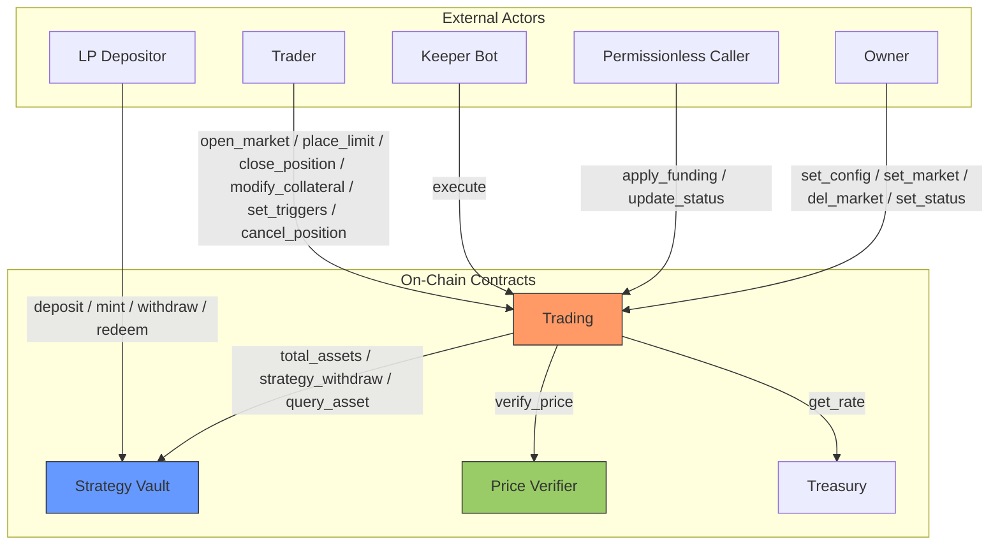

# Architecture Overview

Zenex is a leveraged perpetual futures protocol built on [Stellar Soroban](https://soroban.stellar.org/). The system consists of several smart contracts deployed atomically through a factory, interacting through well-defined interfaces.

## System Contracts

| Contract | Role |
|---|---|
| **Trading** | Core perpetual futures engine handling positions, PnL, fees, funding, liquidation, and ADL |
| **Strategy Vault** | ERC-4626 tokenized vault acting as the liquidity pool and counterparty to traders |
| **Treasury** | Protocol fee accumulator with a configurable rate |
| **Factory** | Deterministic deployer for trading + vault pairs |
| **Governance** | Optional timelock proxy for governance-controlled parameter changes |
| **Price Verifier** | Pyth Lazer oracle that parses and verifies signed price updates |

Users interact with the perp engine through any Stellar wallet. The optional [`soroban-smart-account`](https://github.com/zenith-protocols/soroban-smart-account) repo provides a smart account, signature verifiers, a session policy, and a stateless fee-forwarder for gasless relays. See [Smart Account](./account/overview) for the full breakdown.

## Data Flow

The trading contract is the only contract directly admin-controlled in the diagram. The price verifier and treasury both have their own owners that can update configuration (`update_max_staleness` and similar on price verifier, `set_rate` and `withdraw` on treasury). Those owners may be the same account, separate accounts, or a governance contract per deployment. See the dedicated [Governance](./governance/overview), [Treasury](./treasury/overview), and [Price Verifier](./price-verifier/overview) pages for the full owner-only surface on each contract.

The vault has no knowledge of trading internals. The trading contract calls the vault through a minimal interface (`total_assets`, `strategy_withdraw`, `query_asset`). The dependency is one-directional, which keeps the call graph and storage ownership easy to reason about.

Trading invokes `verify_price` (singular) on per-trade entrypoints (`open_market`, `close_position`, `modify_collateral`, `execute`) and `verify_prices` (plural) only from `update_status`, where every market price is read at once for the global PnL/ADL pass.

The governance contract is an independent, optional contract. It is not deployed by the factory and is not bound to any specific target. It can be set as the owner of any admin-controlled contract (trading, treasury, price verifier, or even a separate governance instance) and adds a configurable timelock delay to parameter changes on whatever it owns. Owner-only calls flow through `queue → execute`, where `execute` is itself permissionless once the delay has elapsed. The one bypass is `set_status`, which lets the governance owner immediately set the status of a target trading contract without going through the queue, so the contract can be frozen in an emergency without waiting for the delay.

## Token Flow

All collateral flows through a single SEP-41 token (e.g., USDC). The trading contract acts as custodian for active position collateral. Protocol fees (base, impact, funding, borrowing, liquidation) are not paid on top of collateral. They are debited from the position's collateral inside the trading contract and split between the vault and the treasury.

| Flow | Direction | When |
|---|---|---|
| User to Trading | Collateral on position open | `open_market`, `place_limit` |
| Trading to Vault | LP share of fees (debited from collateral) | Open, close, fill, liquidation |
| Trading to Treasury | Protocol share of fees (debited from collateral) | Open, close, fill, liquidation |
| Vault to Trading | Trader profit payout | `strategy_withdraw` on profitable close |
| Trading to User | Remaining collateral + profit (or zero if liquidated) | `close_position`, keeper TP/SL |
| Trading to Keeper | Caller incentive fee | Keeper `execute` batch |
| Treasury to Recipient | Protocol revenue withdrawal (destination chosen by owner) | `withdraw` (owner-only) |

## Deployment Model

The factory deploys trading and vault as an atomic pair with deterministic, precomputed addresses. Each contract's wiring (dependency addresses, ownership, global trading config, vault share metadata) is set in its constructor, so neither needs a separate `initialize` call. Markets are not part of construction. They are registered after deployment by the trading owner via `set_market(market_id, config)` for each pair.

If the deployment will route ownership through a governance contract, register all initial markets first under a regular account owner and transfer ownership to governance afterward. Doing it in the reverse order forces every initial `set_market` call through the timelock delay, which adds the configured wait per market with no security benefit during bringup.

Implementation detail (salt derivation, deploy ordering, address precomputation) lives on the [Factory](./factory/overview) page.

