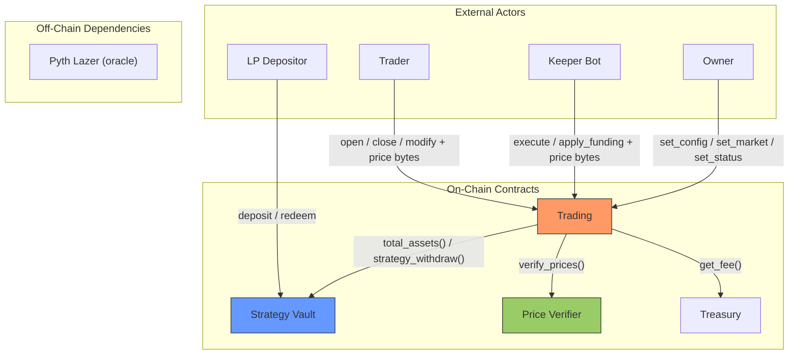

# Architecture Overview

Zenex is a leveraged perpetual futures protocol built on [Stellar Soroban](https://soroban.stellar.org/). The system consists of several smart contracts deployed atomically through a factory, interacting through well-defined interfaces.

## System Contracts

| Contract | Role |
|---|---|
| **Trading** | Core perpetual futures engine handling positions, PnL, fees, funding, liquidation, and ADL |
| **Strategy Vault** | ERC-4626 tokenized vault acting as the liquidity pool and counterparty to traders |
| **Treasury** | Protocol fee accumulator with a configurable rate |
| **Factory** | Deterministic deployer for trading + vault pairs |
| **Governance** | Optional timelock proxy for governance-controlled parameter changes |
| **Price Verifier** | Pyth Lazer oracle that parses and verifies signed price updates |
| **Account** | Smart account with multi-signer support (Ed25519, WebAuthn) |

## Data Flow

The vault has no knowledge of trading internals. The trading contract calls the vault through a minimal interface (`total_assets`, `strategy_withdraw`). This one-directional dependency simplifies reentrancy analysis.

The governance contract is an independent, optional contract. It is not deployed by the factory. When used, it acts as the owner of a trading contract, adding timelock delays to parameter changes.

## Token Flow

All collateral flows through a single SEP-41 token (e.g., USDC). The trading contract acts as custodian for active position collateral.

| Flow | Direction | When |
|---|---|---|
| User to Trading | Collateral + fees on position open | `open_market`, `place_limit` |
| Trading to Vault | Fees (minus protocol share) on every trade | Open, close, fill |
| Trading to Treasury | Protocol fee on every trade | Open, close, fill |
| Vault to Trading | Trader profit payout | `strategy_withdraw` on profitable close |
| Trading to User | Collateral + profit on close | `close_position`, keeper TP/SL |
| Trading to Keeper | Caller incentive fee | Keeper `execute` batch |

## Deployment Model

The factory deploys trading + vault pairs atomically with deterministic addresses. Both addresses are precomputed using Soroban's native `deployed_address()` mechanism. The vault salt is derived from the user-provided salt by XORing the last byte (`salt[31] ^= 1`), giving two distinct but deterministic addresses. The vault is deployed first, receiving the precomputed trading address as its authorized strategy. The trading contract is deployed second, receiving the vault address. The factory then records the trading address in its registry.

This ensures neither contract requires a post-deployment initialization step. Both are fully configured at construction time.

