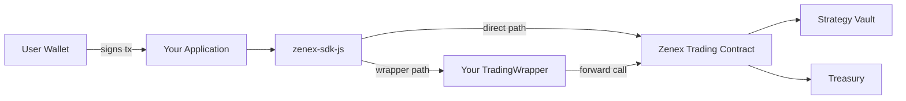

# Integrations Overview

Zenex is designed to be embedded. The core trading contract is a public, permissionless primitive: any frontend, aggregator, wallet, or trading bot can call its functions directly. There is no whitelist, no API gateway, and no application that owns the user relationship. Any developer who wants to offer Zenex perpetuals to their users can do so without permission, and the protocol settles every trade against the same shared vault regardless of which interface initiated it.

This page explains the two integration paths a developer can choose between and the trust and economic tradeoffs of each. The other pages in this section cover the components in detail: the trading wrapper contract, how to deploy and configure your own wrapper, and how to use the JavaScript SDK to drive trades from a frontend.

## Two Integration Paths

There are two ways to build on Zenex, and the choice comes down to whether you want to charge your users a fee on top of the protocol fee.

The **direct path** has your application call the trading contract itself. Your users pay the standard Zenex protocol fees (base, impact, funding, borrowing, liquidation) and nothing else. You earn no per-trade revenue from the protocol. This is the simplest integration and is appropriate when your business model lives elsewhere — for example, a wallet that surfaces Zenex as one of many DeFi options, or a dashboard that aggregates positions across protocols.

The **wrapper path** has your application call a `TradingWrapper` contract that you have deployed and own. The wrapper proxies calls to the trading contract while charging an integrator fee that you keep. Users still pay the same protocol fees; the integrator fee is an additional amount on top, calculated against the position's notional size. This is the path to choose when you want a margin on every trade your users make — a trading frontend with its own brand, a copy-trading product, a structured-product platform that wraps perpetuals, and so on. The wrapper is owned and operated by you, the protocol has no say in your fee rate, and accumulated fees are withdrawable to any address you control.

You can mix both paths in the same application. For example, you might route market orders through your wrapper (where you take a fee) and route position reads, modifications, or cancellations directly to the trading contract (where there is no fee to add). Nothing prevents this — the wrapper is opt-in per call.

## Architecture

A user signs a transaction in your application. The SDK builds the operation and submits it to the network. If the operation calls your wrapper, the wrapper transfers the integrator fee from the user, then forwards the rest of the call (with the user as the principal) to the trading contract. The trading contract performs the trade against the vault and, on open or close, pays the protocol fee to the treasury. From the trading contract's perspective, the user is always the one taking the position — the wrapper does not custody collateral, hold the position, or stand between the user and settlement. This means that even if the wrapper were upgraded or compromised, the user's existing positions and their collateral inside the trading contract are unaffected.

## Where Fees Go

Every trade pays two distinct streams of fees. The first stream is the **Zenex protocol fees**: a base fee, an impact fee on the dominant side, funding charged hourly to whichever side is dominant in the market, borrowing interest charged to the dominant side, and a liquidation fee if a position is force-closed. These are documented in detail in the [Trading Fees](/technical/trading/fee-system) section. The protocol fees are deducted from the user's collateral inside the trading contract and are split between the strategy vault (the liquidity providers) and the treasury (the protocol, governed by the treasury rate). Integrators on the direct path interact with these fees only as a pass-through; they do not earn from them.

The second stream is the **integrator fee**, present only on the wrapper path. The wrapper computes the integrator fee as `notional_size × fee_rate`, where `fee_rate` is set by the wrapper's owner in `SCALAR_7` units (so a `fee_rate` of `10_000` is `0.1%` of notional). The fee is transferred from the user to the wrapper contract on the same transaction as the trade, on top of the collateral transfer. The wrapper accumulates fees in its own balance, and the owner can withdraw them to any address using the `withdraw` function. Notional was chosen as the basis (rather than collateral) because it scales with the size of the user's exposure rather than their margin, which is closer to how exchange taker fees work.

## Trust Model and Limitations

A user trading through your wrapper is trusting you in three specific ways, and it is worth being explicit about them.

First, the wrapper's `fee_rate` is set by its owner with no on-chain cap. A malicious or compromised owner could set the fee rate to an extreme value before a user submits their transaction. A defensive frontend should display the current fee rate to the user and refuse to submit if the simulated fee exceeds an expected bound. We are tracking adding an enforced maximum at the contract level as a follow-up.

Second, the wrapper is upgradeable by its owner. The `upgrade` function swaps in a new WASM hash and is gated by the `Ownable` ownership check. Users implicitly trust the owner not to upgrade to a malicious implementation that, for example, drains user balances at approval time. The same caveat applies to any owner-upgradeable contract on Soroban.

Third, the wrapper does not custody user funds beyond the integrator fee balance. The user's collateral and their open position live in the trading contract, not in the wrapper. If a wrapper were to be paused, replaced, or abandoned by its owner, every user with an open position can still close, modify, or cancel it by calling the trading contract directly via the same SDK — they just lose the wrapper-mediated UX. The protocol provides this escape hatch unconditionally.

## What's Next

If you are evaluating whether to deploy a wrapper, start with [The Trading Wrapper](./trading-wrapper). If you have decided to deploy and want concrete commands, go to [Deploying Your Wrapper](./deploying-a-wrapper). If you are wiring up a frontend and want code samples, see the [SDK Quickstart](./sdk-quickstart).
